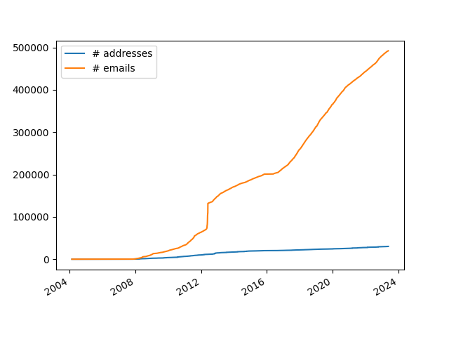
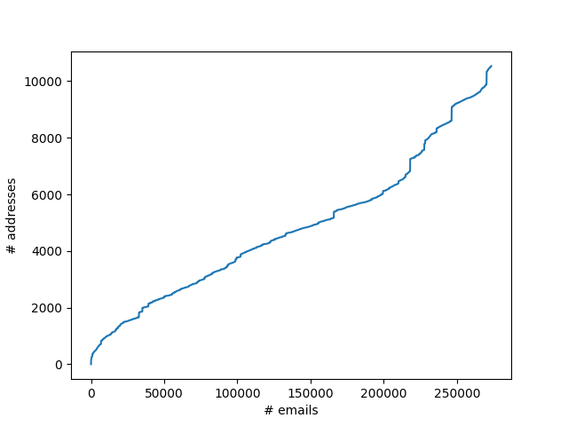

# Description

Generates a ranked addressbook from a maildir folder. It can be used in MUA's
like [aerc](aerc-mail.org) or [mutt](http://www.mutt.org/) by grepping the
list.

Why? No need to manually edit an address book, yet the cached ranking is
available extremely fast.

### Features:
- scans all your emails
- ranks based on both recency and frequency of addresses
- collects from To, Cc, Bcc and From fields
- ranks addresses explicitly emailed by you higher
- configurable output via go templates
- uses the most frequent display name for each email
- filters common "no reply" addresses
- normalizes emails to lower case
- "blazingly fast"*: crunch time for 270k emails is 7s on my machine, grepping from the output is instantaneous

*: compared to original python implementation for crunching (see Behind the scenes below) and compared to using notmuch query for address completion

### Planned features:

- configurable filtering based on regex

# Installation

The easiest way to install is running:
```
go install github.com/ferdinandyb/maildir-rank-addr@latest
```

# Usage

At the minimum, you need to specify where your maildir formatted email are:

```
maildir-rank-addr --maildir=~/.mail
```

For most use cases, it likely only needs to be run once or twice a day (cronjob
or systemd timer).

Supported flags:

```
      --addresses strings   comma separated list of your email addresses (regex possible)
      --filters strings     comma separated list of regexes to filter
      --maildir string      path to maildir folder
      --outputpath string   path to output file
      --template string     output template
```

**maildir**

The path to the folder that will be scanned. No default is set for this.

**outputpath**

By default results are output to
`$HOME/.cache/maildir-rank-addr/addressbook.tsv"`.

**addresses**

List of your own email addresses. If you do not provide your own addresses,
classicifation based on your explicit sends will not be possible!

**template**

Uses go's `text/template` to configure output for each address (one line per address).
Available keys:
```
	Address
	Name
	Names
	Class
	FrequencyRank
	RecencyRank
	TotalRank
	ClassCount
	ClassDate
```

Default: `{{.Address}}\t{{.Name}}`

**filters**

List of regexes. If an address is matched against a regex, it will be excluded
from the output. The regex is matched against the entire email address.

Note that we already filter out addresses, where the local part (the part
before the @) matches any of these strings:

```
	"do-not-reply",
	"donotreply",
	"no-reply",
	"bounce",
	"noreply",
	"no.reply",
	"no_reply",
	"nevalaszolj",
	"nincsvalasz",
```

## config file

Besides the flags, toml formatted configuration file is also possible. It's
first looked for at `$HOME/.config/maildir-rank-addr/config` and then the
current working directory.

Complete example configuration with the default (aerc compatible) template:

```
maildir = "~/.mail"
addresses = [
    "address1@example.com",
    "address2@otherexample.com"
]
filters = ["@spam.(com|org)"]
outputpath = "~/.mail/addressbook"
template = "{{.Address}}\t{{.Name}}"
```


## Integration

#### aerc

Put something like this in your aerc config (using your favourite grep):
```
address-book-cmd="ugrep -i --color=never %s /home/[myuser]/.cache/maildir-rank-addr/addressbook.tsv"
```

Note that `address-book-cmd` is not executed in the shell, so you need to hard
code the path without shell expansion.

# Behind the scenes

## Ranking

Ranking is actually done by first classifying and then ranking within class.


### Classifying addresses

First we go through each email found in your maildir and for each address found in any of the address headers we assign a class, based on whether the sender is you or not and which type of header the address was found in:

- 2: from address is yours, address found in To, or Bcc,
- 1: from address is yours, address found in Cc,
- 0: From fields and anything else.

For each _unique_ address seen, we record a class dates (the date of the latest email in which that address was assigned class X) and class counts (the number of times in which that address was assigned class X). The unique address itself also get assigned a class, which is the highest class it was seen in.

#### Example

Bob writes Alice 3 letters and Alice answers one of them. When Alice runs the software both email addresses will recieve 3 counts to class 0 and have the class date for 0 at the latest email. Alice now answers one of Bob's emails and Cc-s Eve. Alice's address receives another count for class 0 and the date is also updated. Eve's address receive a count for class 1 and Bob's email receives a count for class 2 with the class 2 date being set to this latest email. This put's Bob's email address as class 2 as that is the highest class it has, Eve's at class 1 and Alice's own address in class 0.

### Ranking

The addresses are then ranked by their highest class based on only the highest's class's count and date. The output will be structured so class 2 emails are on the top, then class 1 email and class 0 emails are at the bottom. This solves to things, first all mailinglists and marketing which you get, but only read will be available to send to, but guaranteed to be at the very bottom of search results. Second, even if you accindentally replied to a newsletter email which you get daily, it's class count will be just 1, so even though it's a bit higher up now due to the reply, it will still feature at the bottom of it's class and not get conflated by having received hundreds of email from the address pretty recently.

**Frequency rank:** The emails are ordered according to the class count and their frequency rank becomes their place in this ordered list, with the highest count receiving a rank of 0.

**Recency rank:** Similary, the emails are ordered again, now based on their class date, where the most recent email receives the rank of 0.

**Total rank = Frequency rank + Recency Rank**

The output is then generated by printing class 2 address from lowest to highest rank, then class 1 addresses from lowest to highest and finally class 0 addresses from lowest to highest.

## Statistics

The amount of email I have seems to grow approximately linearly and the amount
of email addresses also more-or-less, but with a much-much smaller coefficient.
Compared to needing to grep the email headers caching the unique address leads
to a 250x compression. Since grep retains ordering of results in a file, it
also makes sense encoding rankings by simply ordering the addresses.

You can generate these images for yourself using the python script `stats/generateEmailStatistics.py`.




The `stats` folder also includes the original PoC implementation of this in
python (`stats/generateAddressbookMaildir.py`) which takes a whopping 36
_minutes_ to complete the same task, compared to this implementation's 10
_seconds_.

# Contribution

Patches sent in email are also welcome :)

# Similar Projects

- [maildir2addr](https://github.com/BourgeoisBear/maildir2addr)
- [notmuch-addrlookup-c](https://github.com/aperezdc/notmuch-addrlookup-c)


# Acknowledgments

Some functions for parsing email was taken from [aerc](aerc-mail.org).
