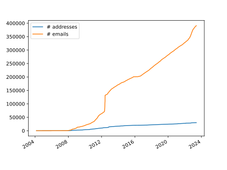
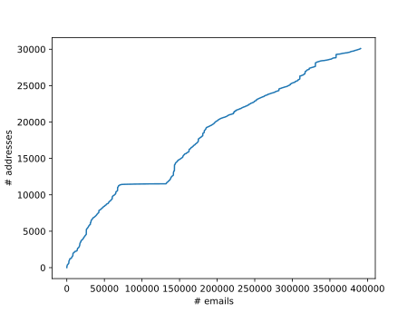

# Description

Generates a ranked addressbook from a maildir (or similar one-mail-per-file)
folder. It can be used in MUA's like [aerc](http://aerc-mail.org) or
[mutt](http://www.mutt.org/) by grepping the list.

Why? No need to manually edit an address book, yet the cached ranking is
available extremely fast.

### Features:

- scans all your emails
- ranks based on both recency and frequency of addresses
- collects from To, Cc, Bcc and From fields
- ranks addresses explicitly emailed by you higher
- configurable output via go templates
- uses the most frequent non-empty display name for each email
- display name can be unicode normalized for search purposes
- filters common "no reply" addresses, additional filters can be added via regexes
- normalizes emails to lower case
- ability to add additional email addresses from a command
- "blazingly fast"<sup>\*</sup>: crunch time for 270k emails is 7s on my machine, grepping from the output is instantaneous

<sup>\*</sup>: compared to original python implementation for crunching (see Behind the scenes below) and compared to using notmuch query for address completion

# Installation

The easiest way to install is running:

```
go install github.com/ferdinandyb/maildir-rank-addr@latest
```

Arch users can also install it from AUR, either the `maildir-rank-addr` or the `maildir-rank-addr-git` package.

# Usage

At the minimum, you need to specify where your maildir formatted email are:

```
maildir-rank-addr --maildir=~/.mail
```

For most use cases, it likely only needs to be run once or twice a day (cronjob
or systemd timer).

Supported flags:

```
      --addr-book-cmd string   optional command to query addresses from your addressbook
      --addr-book-add-unmatched if cmd is stated, determine wether to add unmatched addresses at the end of the file (true or false)
      --addresses strings   comma separated list of your email addresses (regex possible)
      --config string       path to config file
      --filters strings     comma separated list of regexes to filter
      --maildir strings     comma separated list of paths to maildir folders
      --outputpath string   path to output file
      --template string     output template
```

**maildir**

The paths to the folders that will be scanned. No default is set for this.
These actually do NOT need to be maildir format folders, it only assumes that
each file is an email (it will skip any hidden files and anything that is in
a folder called `tmp`).

**outputpath**

By default results are output to
`$HOME/.cache/maildir-rank-addr/addressbook.tsv"`. Specifing `-` as the
outputpath will print to STDOUT.

**addresses**

List of your own email addresses. If you do not provide your own addresses,
classification based on your explicit sends will not be possible!

**template**

Uses go's `text/template` to configure output for each address (one line per address).
Available keys:

```
	Address
	Name
	NormalizedName: same as Name, but unicode normalized
	Names
	Class
	FrequencyRank
	RecencyRank
	TotalRank
	ClassCount
	ClassDate
```

Default: `{{.Address}}\t{{.Name}}`

**filters**

List of regexes. If an address is matched against a regex, it will be excluded
from the output. The regex is matched against the entire email address.

Note that we already filter out addresses, where the local part (the part
before the @) matches any of these strings:

```
	"do-not-reply",
	"donotreply",
	"no-reply",
	"bounce",
	"noreply",
	"no.reply",
	"no_reply",
	"nevalaszolj",
	"nincsvalasz",
```

**addr-book-cmd**

Optional command to fetch email addresses and names, the output it returns must have
an email address first, followed by a tab space and and the desired name, the name
must end in a tab space or a newline for the command to work, this can be
useful for integrating with command line addressbooks such as abook or khard

```
abook --mutt-query "s"
khard email -p --remove-first-line
```

**config**

Path to a config file to be loaded instead of the defaults (see below).

## config file

Besides the flags, toml formatted configuration file is also possible. It's
first looked for at `$HOME/.config/maildir-rank-addr/config` and then the
current working directory.

Complete example configuration with the default (aerc compatible) template:

```
maildir = "~/.mail"
addresses = [
    "address1@example.com",
    "address2@otherexample.com"
]
filters = ["@spam.(com|org)"]
outputpath = "~/.mail/addressbook"
template = "{{.Address}}\t{{.Name}}\t{{.NormalizedName}}"
```

## Integration

### aerc

Put something like this in your aerc config (using your favourite grep):

```
address-book-cmd="ugrep -jP -m 100 --color=never %s /home/[myuser]/.cache/maildir-rank-addr/addressbook.tsv"
```

(`-j` is smart case insensitive, and needs to be combined with `-P` for UTF-8).

Since aerc only uses the first two of the tab separated columns any other
column can be added to help with search or to combine with external tools. For
example adding `NormalizedName` as the third column will allow you to type
"arpad", and still find and use the entry for "Árpád X" who uses accents in his
name properly, and "Arpad Y" who conformed to ASCII for some reason.

Note that `address-book-cmd` is not executed in the shell, so you need to hard
code the path without shell expansion.

If you are using aerc with `[compose].edit-headers=true` you need integrate
with your editor (e.g. with vim), instead of the above.

### vim

This is an example using `fzf` and the `fzf.vim` plugin. Add it to for example
`~/.vim/after/ftplugin/mail.vim` to load it only for eml files. The example has
been optimized for `aerc` with `[compose].edit-headers=true`. To insert
addresses in the `To:` field, take your cursor to the line containing `To:` and
press `<leader>a`. Use tab to select multiple addresses in the pop-up.

```vimscript
function! InsertAddressAerc()
    call fzf#run(fzf#wrap("insertaddress", {
    \ 'source':'cat ~/.cache/maildir-rank-addr/addressbook.tsv',
    \ 'sink*': function("InsertContactsLine"),
    \ 'options': '--no-sort -i --multi'
    \}))
endfunction

function! InsertAddress()
    call fzf#run(fzf#wrap("insertaddress", {
    \ 'source':'cat ~/.cache/maildir-rank-addr/addressbook.tsv',
    \ 'sink': function("InsertContact"),
    \ 'options': '--no-sort -i'
    \}))
endfunction

function! InsertContactsLine(names) abort
    for name in a:names
        call InsertContactLine(name)
    endfor
endfunction

function! InsertContactLine(name) abort
    let [address, name; rest] = split(a:name,"\t")
    call append(line('.'), '    ' . name . " <" . address . ">,")
endfunction

function! InsertContact(name) abort
    let [address, name; rest] = split(a:name,"\t")
    exec 'normal! a'  . name . " <" . address . ">\<Esc>"
endfunction

nnoremap <leader>a :call InsertAddressAerc()<CR>
nnoremap <leader>A :call InsertAddress()<CR>

```

# Behind the scenes

## Ranking

Ranking is actually done by first classifying and then ranking within class.

### Classifying addresses

First we go through each email found in your maildir and for each address found
in any of the address headers we assign a class, based on whether the sender is
you or not and which type of header the address was found in:

- 2: from address is yours, address found in To, or Bcc,
- 1: from address is yours, address found in Cc,
- 0: From fields and anything else.

For each _unique_ address seen, we record a class dates (the date of the latest
email in which that address was assigned class X) and class counts (the number
of times in which that address was assigned class X). The unique address itself
also get assigned a class, which is the highest class it was seen in.

#### Example

Bob writes Alice 3 letters and Alice answers one of them. When Alice runs the
software both email addresses will receive 3 counts to class 0 and have the
class date for 0 at the latest email. Alice now answers one of Bob's emails and
Cc-s Eve. Alice's address receives another count for class 0 and the date is
also updated. Eve's address receive a count for class 1 and Bob's email
receives a count for class 2 with the class 2 date being set to this latest
email. This puts Bob's email address as class 2 as that is the highest class
it has, Eve's at class 1 and Alice's own address in class 0.

### Ranking

The addresses are then ranked by their highest class based on only the highest
class's count and date. The output will be structured so class 2 emails are on
the top, then class 1 email and class 0 emails are at the bottom. This solves
two things: firstly, all mailing-lists and marketing which you get but only
read will be available to send to, but are guaranteed to be at the very bottom
of search results. Secondly, even if you accidentally replied to a newsletter
email which you get daily, it's class count will be just 1, so even though it's
a bit higher up now due to the reply, it will still feature at the bottom of
it's class and not get conflated by having received hundreds of email from the
address pretty recently.

**Frequency rank:** The emails are ordered according to the class count and
their frequency rank becomes their place in this ordered list, with the highest
count receiving a rank of 0. In case of equal counts the order is the
alphabetical order of the email addresses.

**Recency rank:** Similar, the emails are ordered again, now based on their
class date, where the most recent email receives the rank of 0. In case of
equal dates the order is the alphabetical order of the email addresses.

**Total rank = Frequency rank + Recency Rank**

The output is then generated by printing class 2 address from lowest to highest
rank, then class 1 addresses from lowest to highest and finally class
0 addresses from lowest to highest. In case the total ranks are equal the order
is the alphabetical order of the email addresses.

## Statistics

The amount of email I have seems to grow approximately linearly and the amount
of email addresses also more-or-less, but with a much-much smaller coefficient.
Compared to needing to grep the email headers caching the unique address leads
to a 250x compression. Since grep retains ordering of results in a file, it
also makes sense encoding rankings by simply ordering the addresses.

You can generate these images for yourself using the python script `stats/generateEmailStatistics.py`.




The `stats` folder also includes the original PoC implementation of this in
python (`stats/generateAddressbookMaildir.py`) which takes a whopping 36
_minutes_ to complete the same task, compared to this implementation's 10
_seconds_.

# Contribution

Please see [contribution guidelines](https://github.com/ferdinandyb/maildir-rank-addr/blob/master/CONTRIBUTING.md).

# Similar Projects

- [maildir2addr](https://github.com/BourgeoisBear/maildir2addr): somewhat similar address book generator
- [notmuch-addrlookup-c](https://github.com/aperezdc/notmuch-addrlookup-c): address lookup from notmuch
- [addr-book-combine](https://jasoncarloscox.com/creations/addr-book-combine/): for combining generated addressbooks with hand currated ones, like [khard](https://github.com/lucc/khard)

# Acknowledgments

Some functions for parsing email was taken from [aerc](http://aerc-mail.org).
